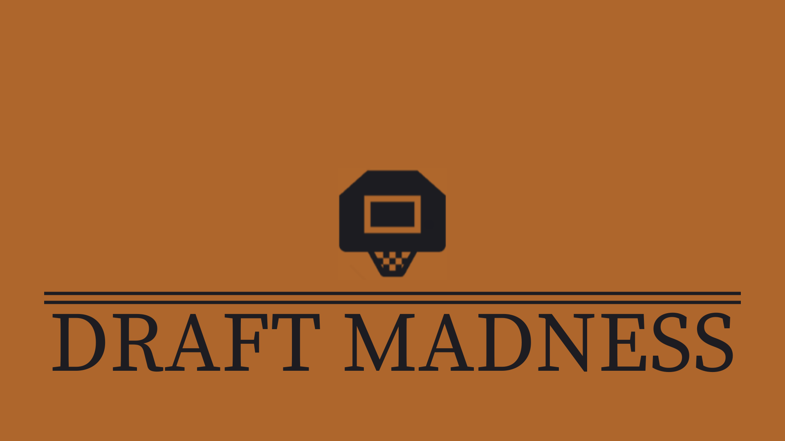

<!-- Improved compatibility of back to top link: See: https://github.com/othneildrew/Best-README-Template/pull/73 -->

<!--
*** Thanks for checking out the Best-README-Template. If you have a suggestion
*** that would make this better, please fork the repo and create a pull request
*** or simply open an issue with the tag "enhancement".
*** Don't forget to give the project a star!
*** Thanks again! Now go create something AMAZING! :D
-->

<!-- PROJECT SHIELDS -->
<!--
*** I'm using markdown "reference style" links for readability.
*** Reference links are enclosed in brackets [ ] instead of parentheses ( ).
*** See the bottom of this document for the declaration of the reference variables
*** for contributors-url, forks-url, etc. This is an optional, concise syntax you may use.
*** https://www.markdownguide.org/basic-syntax/#reference-style-links
-->

[![Contributors][contributors-shield]][contributors-url]
[![Forks][forks-shield]][forks-url]
[![Stargazers][stars-shield]][stars-url]

<!-- PROJECT LOGO -->
 

  

<h2 align="center">Draft Madness</h2>

  

    This is the Backend for our Draft Madness application. This API application stores our databases and consumes and exposes two external APIs. Draft Madness is the Consultancy group project from Turing School of Software and Design's mod three backend program. Read more: https://backend.turing.edu/module3/projects/consultancy/
     
    <a href=https://github.com/ithill22/draft_madness_be><strong>Explore the docs »</strong></a>
     
     
    <a href="https://github.com/ithill22/draft_madness_be/issues">Report Bug</a>
    ·
    <a href="https://github.com/ithill22/draft_madness_be/issues">Request Feature</a>
  

<!-- TABLE OF CONTENTS -->

  
Table of Contents

  <ol>
    <li>
      <a href="#about-the-project">About The Project</a>
      <ul>
        <li><a href="#built-with">Built With</a></li>
      </ul>
    </li>
    <li>
      <a href="#getting-started">Getting Started</a>
      <ul>
        <li><a href="#installation">Installation</a></li>
      </ul>
    </li>
    <li><a href="#roadmap">Roadmap</a></li>
    <li><a href="#contributing">Contributing</a></li>
    <li><a href="#license">License</a></li>
    <li><a href="#contact">Contact</a></li>
  </ol>

<!-- ABOUT THE PROJECT -->
## About The Project
Draft Madness is a Rails application that brings the excitement of March Madness to your fingertips. It allows users to participate in a thrilling fantasy game where they draft their own set of teams from the 64-team pool and earn points based on the multiplier of each team's seed. Enjoy the excitement of March Madness with Draft Madness!

(<a href="#readme-top">back to top</a>)

### Built With

* [![Ruby][Ruby]][Ruby-url]
* [![Rails][Rails]][Rails-url]
* [![PostgreSQL][Postgres]][Postgres-url]
* [![CircleCI][CircleCI]][CircleCI-url]

Integrations:
* Draft Madness uses OAuth integration with Google for user authentication and log in

(<a href="#readme-top">back to top</a>)

<!-- GETTING STARTED -->
## Getting Started

To get a local copy up and running follow these simple example steps.

### Installation

1. Fork the repo
2. Clone the repo

   `git clone https://github.com/ithill22/draft_madness_be.git`
3. Install the gems

   `bundle install`
4. Create and migrate the database

   `rails db:{create,migrate}`
5. In your terminal run

    `rails s`

6. Now go and open up to http://localhost:3000 in your browser
7. Now go to: https://github.com/ithill22/draft_madness_fe#readme and follow the Getting Started instructions in the README to start up the frontend application and enjoy the madness!

(<a href="#readme-top">back to top</a>)

<!-- ROADMAP -->
## Roadmap

See the [open issues](https://github.com/ithill22/draft_madness_be/issues) for a full list of proposed features (and known issues).

(<a href="#readme-top">back to top</a>)

<!-- CONTRIBUTING -->
## Contributing

Contributions are what make the open source community such an amazing place to learn, inspire, and create. Any contributions you make are **greatly appreciated**.

If you have a suggestion that would make this better, please fork the repo and create a pull request. You can also simply open an issue with the tag "enhancement".
Don't forget to give the project a star! Thanks again!

1. Fork the Project
2. Create your Feature Branch (`git checkout -b feature/AmazingFeature`)
3. Commit your Changes (`git commit -m 'Add some AmazingFeature'`)
4. Push to the Branch (`git push origin feature/AmazingFeature`)
5. Open a Pull Request

(<a href="#readme-top">back to top</a>)

<!-- LICENSE -->
## License

Distributed under the MIT License.

(<a href="#readme-top">back to top</a>)

<!-- CONTACT -->
## Contact

* Alec Kapicak: [![Linkedin][linkedin]][alec-li-url] [![Github][Github]][alec-gh-url]
* Katie Lonsdale: [![Linkedin][linkedin]][katie-li-url] [![Github][Github]][katie-gh-url]
* Isaac Thill: [![Linkedin][linkedin]][isaac-li-url] [![Github][Github]][isaac-gh-url]
* Reid Miller: [![Linkedin][linkedin]][reid-li-url] [![Github][Github]][reid-gh-url]

* Front End: [![Github][Github]][project-fe-gh-url]
* Back End: [![Github][Github]][project-be-gh-url]

(<a href="#readme-top">back to top</a>)

<!-- MARKDOWN LINKS & IMAGES -->
<!-- https://www.markdownguide.org/basic-syntax/#reference-style-links -->
[contributors-shield]: https://img.shields.io/github/contributors/ithill22/draft_madness_be.svg?style=for-the-badge
[contributors-url]: https://github.com/ithill22/draft_madness_be/graphs/contributors
[forks-shield]: https://img.shields.io/github/forks/ithill22/draft_madness_be.svg?style=for-the-badge
[forks-url]: https://github.com//ithill22/draft_madness_be/network/members

[stars-shield]: https://img.shields.io/github/stars/ithill22/draft_madness_be.svg?style=for-the-badge
[stars-url]: https://github.com/ithill22/draft_madness_be/stargazers
[issues-url]: https://github.com/ithill22/draft_madness_be/issues

[linkedin]: https://img.shields.io/badge/LinkedIn-0077B5?style=for-the-badge&logo=linkedin&logoColor=white
[alec-li-url]: https://www.linkedin.com/in/alec-kapicak-b703bab8/
[katie-li-url]: https://www.linkedin.com/in/katherine-lonsdale-7b215185/
[isaac-li-url]: https://www.linkedin.com/in/isaac-thill/
[reid-li-url]: https://www.linkedin.com/in/reid-s-miller/
[product-screenshot]: images/screenshot.png
[Ruby]: https://img.shields.io/badge/Ruby-CC342D?style=for-the-badge&logo=ruby&logoColor=white
[Ruby-url]: https://www.ruby-lang.org/en/
[Rails]: https://img.shields.io/badge/Ruby_on_Rails-CC0000?style=for-the-badge&logo=ruby-on-rails&logoColor=white
[Rails-url]: https://rubyonrails.org/
[Postgres]: https://img.shields.io/badge/PostgreSQL-316192?style=for-the-badge&logo=postgresql&logoColor=white
[Postgres-url]: https://www.postgresql.org/
[Redis]:  	https://img.shields.io/badge/redis-%23DD0031.svg?&style=for-the-badge&logo=redis&logoColor=white
[Redis-url]: https://redis.io
[CircleCI]: https://img.shields.io/badge/circleci-343434?style=for-the-badge&logo=circleci&logoColor=white
[CircleCI-url]: https://circleci.com/
[Github]: https://img.shields.io/badge/GitHub-100000?style=for-the-badge&logo=github&logoColor=white
[project-fe-gh-url]: https://github.com/ithill22/draft_madness_fe
[project-be-gh-url]: https://github.com/ithill22/draft_madness_be
[alec-gh-url]: https://github.com/AlecKap
[katie-gh-url]: https://github.com/KatieLonsdale
[isaac-gh-url]: https://github.com/ithill22
[reid-gh-url]: https://github.com/reidsmiller